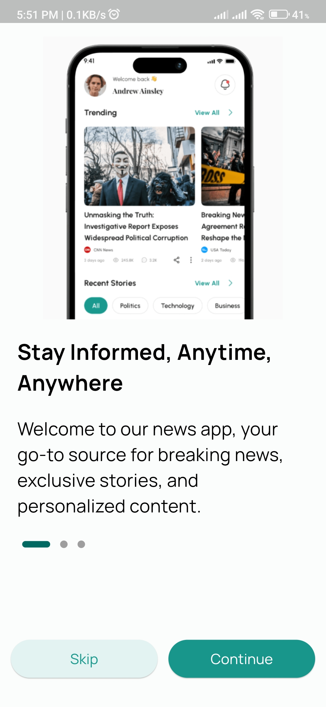
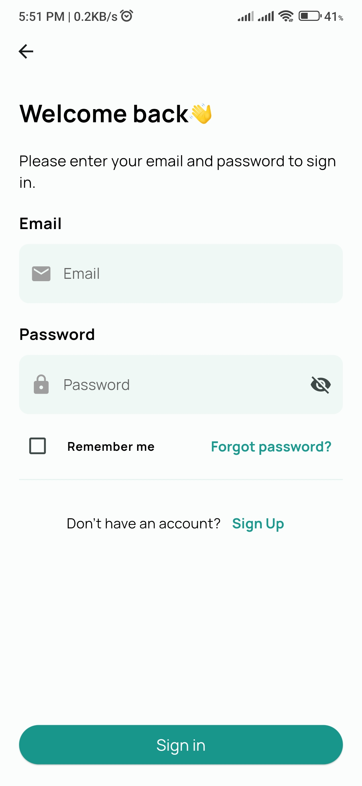
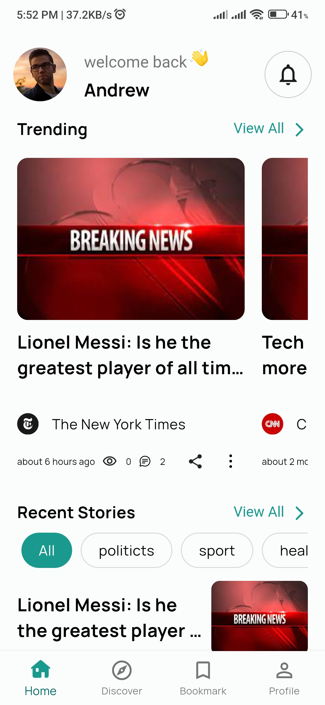
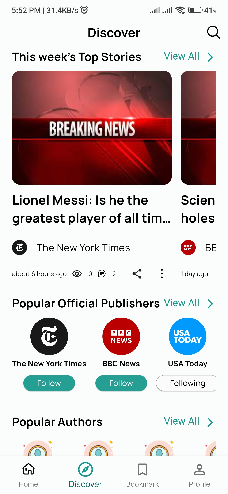
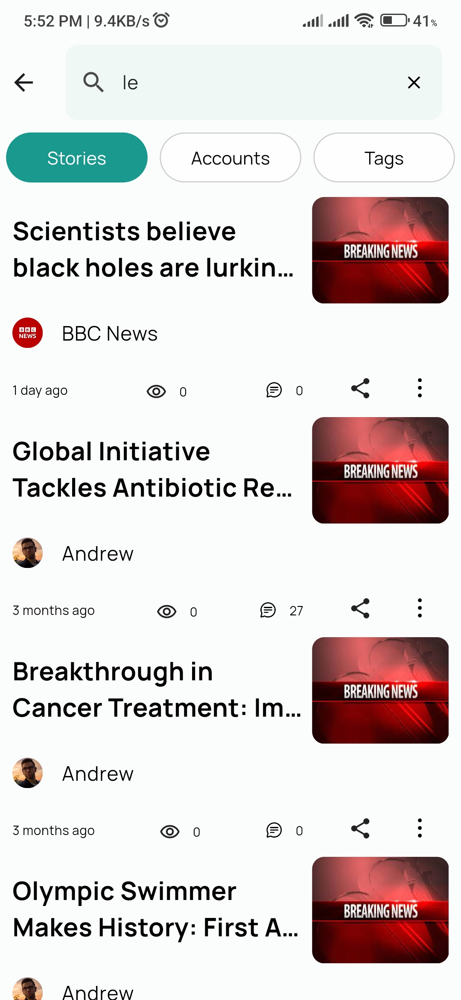
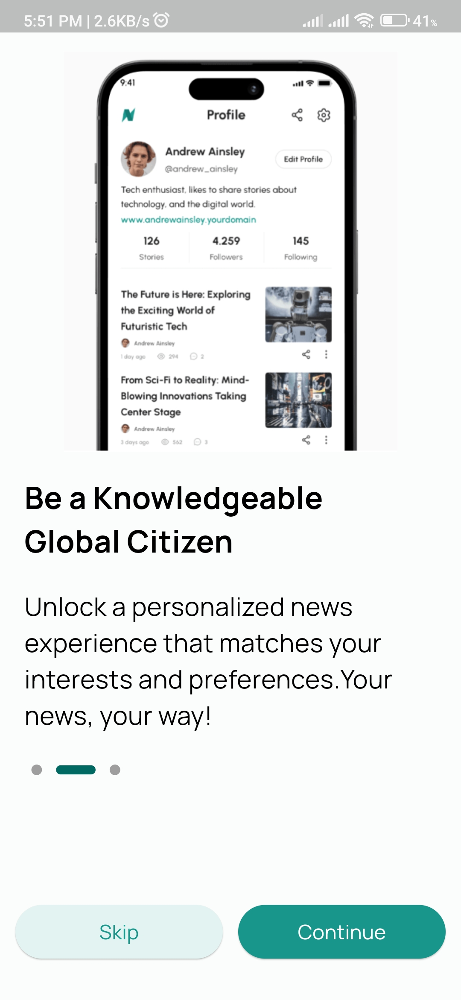
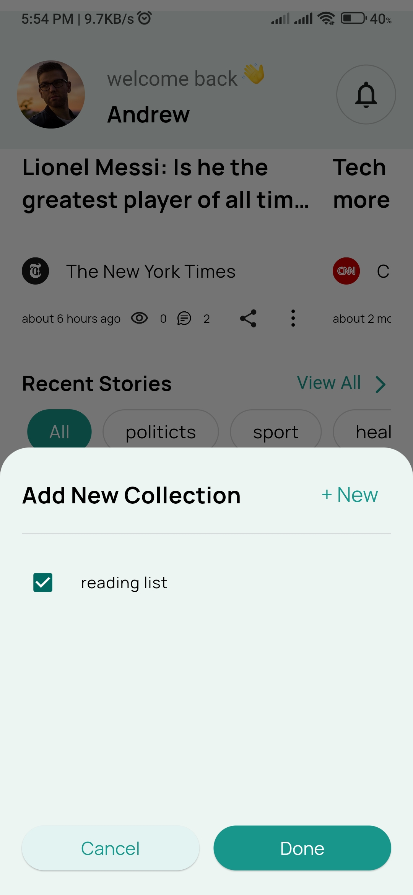
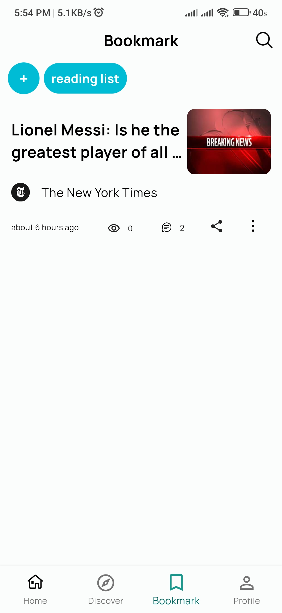

# News Line App
News line app it's a **Clean Architecture** project that using **Bloc** for state managment, freezed, objectbox,...
 
**For Api we use this repo** [news line api](https://github.com/mdevzs/nestjs_news_line)

## Dependencies
- [flutter_bloc](https://pub.dev/packages/flutter_bloc)
- [retrofit](https://pub.dev/packages/retrofit)
- [freezed](https://pub.dev/packages/freezed)
- [objectbox](https://pub.dev/packages/objectbox)
- [flutter quill](https://pub.dev/packages/flutter_quill)
- ...
 
For view all the dependencies see the pubspec.yaml file.

## ToDo
- [ ] connect write story feature to api
- [ ] settings feature
- [ ] display settings (for news_details_page)
- [ ] notification feature

## Screenshots
Here is just some of the screenshots from the app
|Onboarding|Sgin in|Home|Discover|Bookmark
|---------------------------------------------------|--|-|-|-|
||              |              |                ||||
|||||
|||||

**The Ui is from [Here](https://www.figma.com/community/file/1259795896521415450/newsline-news-app-ui-kit) you can use the preview for see all screens**

